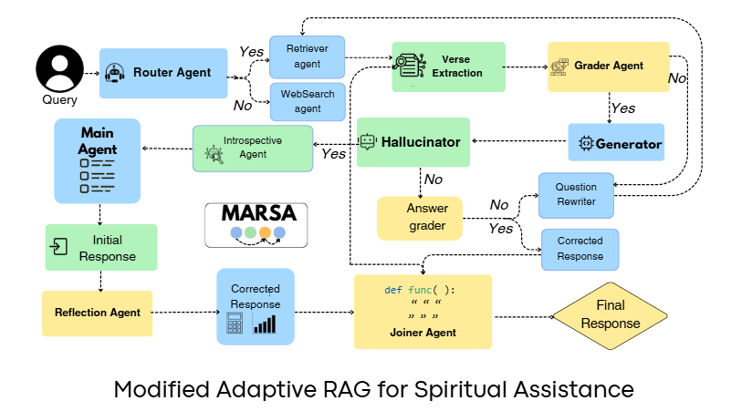

# NYD Hackathon 2024

## Overview

**Agentic Retrieval-Augmented Generation (RAG)** based pipeline designed mainly for **The NYD Hackathon**. This pipeline, named **MARSA (Modified Adaptive RAG for Spiritual Assistance)**, provides accurate and contextually rich responses to user queries related to the Bhagavad Gita and Patanjali Yoga Sutras. It integrates advanced NLP techniques with multiple specialized agents to ensure high-quality outputs.




---

## Key Features

### MARSA Pipeline Components

1. **Router Agent**: Routes queries to either the vectorstore (for internal documents) or the web search agent.
2. **Web Search Agent**: Uses Tavily search to fetch real-time data from the web.
3. **Retrieval Agent**: Enhances retrieval accuracy using a reranker and a context compression retriever.
4. **Verse Extractor Agent**: Extracts chapter and verse references from the Bhagavad Gita and Patanjali Yoga Sutras.
5. **Grader Agent**: Validates the relevance of retrieved documents.
6. **Question Rewriter Agent**: Refines ambiguous queries for improved processing.
7. **Generator Agent**: Generates final responses with contextual memory.
8. **Hallucination Grader Agent**: Detects and minimizes hallucinated facts.
9. **Introspective Agent**: Refines responses for accuracy and reduces toxicity.
10. **Joiner Agent**: Combines the response with chapter and verse references for a coherent output.

### Evaluation Metrics
The pipeline is evaluated using:
- **BERT Score**
- **BLEU Score**
- **ROUGE-L**
- **Verse Accuracy**
- **Chapter Accuracy**
- **Faithfulness**
- **Contextual Recall**

---

## Repository Structure

```
.
├── adaptive_rag                 # Contains the main RAG pipeline
├── Chain-of-Abstraction         # Chain of abstraction agent
├── Chunking_TextSplitter        # chunking text
├── Combined_Data                # Aggregated data for training and testing
├── Data                         # Raw data files
├── Data_Augmentation            # Scripts for data augmentation
├── Data_Connector               # Connectors for external data sources
├── Embedder                     # Embedding utilities
├── LLMCompiler                  # LLMCompiler pipeline
├── Query_Transformations        # Query transformation utilities
├── ReactAgent                   # ReAct agent implementation
├── ReRanker                     # Reranking utilities
├── Retriever                    # Retrieval utilities
├── VectorStore                  # Vector store utilities
├── requirements.txt             # Python dependencies
└── README.md                    # Project documentation
```

---

## Getting Started


### Installation

1. **Clone the Repository**:

   ```bash
   git clone https://github.com/Agniva2004/NYD_Hackathon.git
   cd NYD_Hackathon
   ```

2. **Create a Virtual Environment** (optional but recommended):

   ```bash
   python -m venv env
   source env/bin/activate   # On Windows: env\Scripts\activate
   ```

3. **Install Dependencies**:

   ```bash
   pip install -r requirements.txt
   ```

### Running the Application

1. **Streamlit Application**:

   Navigate to the `adaptive_rag` folder:

   ```bash
   cd adaptive_rag
   streamlit run app.py
   ```

2. **Query Processing**:

   Run the pipeline for user queries:

   ```bash
   python adaptive_class_main.py
   ```

3. **Evaluation**:

   Evaluate the pipeline using `eval.py`:

   ```bash
   python eval.py
   ```

---

**Setting Up API Keys**
To run the pipeline, create a .env file in the root directory(it is already provided, if api exhausts then one needs to provide his own) and add the required API keys in the following format:
```bash
GROQ_API_KEYS=<your_groq_api_key>
COHERE_API_KEY=<your_cohere_api_key>
HUGGINGFACEHUB_API_TOKEN=<your_huggingface_api_token>
PINECONE_API_KEY=<your_pinecone_api_key>
TAVILY_API_KEY=<your_tavily_api_key>
LANGCHAIN_API_KEY=<your_langchain_api_key>
SERPER_API_KEY=<your_serper_api_key>
```


## Contributing

Contributions are welcome! To contribute:

1. Fork the repository.
2. Create a new branch for your feature or bug fix:
   ```bash
   git checkout -b feature-name
   ```
3. Commit your changes:
   ```bash
   git commit -m "Description of changes"
   ```
4. Push to your branch:
   ```bash
   git push origin feature-name
   ```
5. Open a pull request.
   

**Conclusion**

MARSA serves as a robust demonstration of how advanced NLP techniques can be leveraged to provide meaningful spiritual assistance. Designed to handle nuanced queries and maintain contextual accuracy, MARSA represents a significant step in blending technology with ancient wisdom. We look forward to seeing how this pipeline evolves and contributes to broader applications in the future. Your feedback and contributions are invaluable to further enhance this project.


---


